

## Abstract

Grasping objects in cluttered environments remains a fundamental yet challenging problem in robotic manipulation. While prior works have explored learning-based synergies between pushing and grasping for two-fingered grippers, few have leveraged the high degrees of freedom (DoF) in dexterous hands to perform efficient singulation for grasping in cluttered settings. In this work, we introduce DexSinGrasp, a unified policy for dexterous object singulation and grasping. DexSinGrasp enables high-dexterity object singulation to facilitate grasping, significantly improving efficiency and effectiveness in cluttered environments. We incorporate clutter arrangement curriculum learning to enhance success rates and generalization across diverse clutter conditions, while policy distillation enables a deployable vision-based grasping strategy. To evaluate our approach, we introduce a set of cluttered grasping tasks with varying object arrangements and occlusion levels. Experimental results show that our method outperforms baselines in both efficiency and grasping success rate. Experimental results show that our method outperforms baselines in both efficiency and grasping success rate, particularly in dense clutter. Codes, appendix, and videos are available on our project website https://nus-lins-lab.github.io/dexsingweb/.

## Pipeline Overview


Firstly, we employ clutter arrangement curriculum learning to progressively improve our teacher policy's performance, and acquire two teacher policies at the end of this stage for dense and random arrangement tasks, respectively. We then collect various state and action data along with pointcloud data from the trained two teachers to train a vision-based student policy via behavior cloning, which better facilitates real-world deployment.

## Cluttered Environments Generation


We introduce a cluttered environment generation module to create diverse object settings, including different obstacle quantities from 0 to 8, dense and random arrangements, various poses, and block shapes. For simplicity, we only show obstacles with numbers 4 to 8.

## Simulation Experiments

|             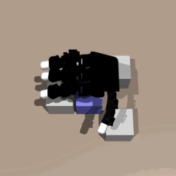             |             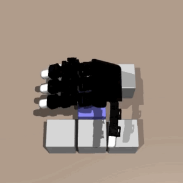             |             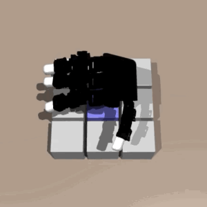             |
| :---------------------------------: | :---------------------------------: | :---------------------------------: |
| Dense arrangement with 4 obstacles  | Dense arrangement with 6 obstacles  | Dense arrangement with 8 obstacles  |
|             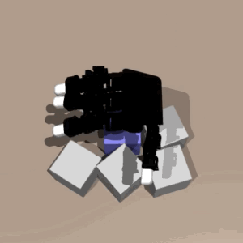             |             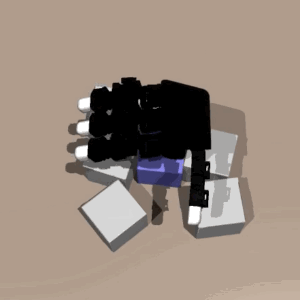             |             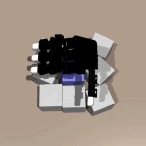             |
| Random arrangement with 4 obstacles | Random arrangement with 6 obstacles | Random arrangement with 8 obstacles |

## Real-World Experiments

|             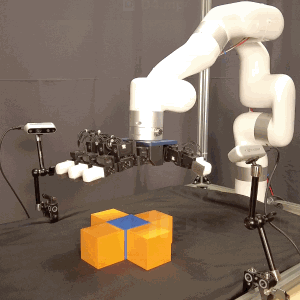             |             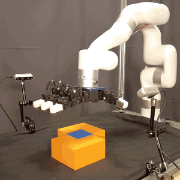             |             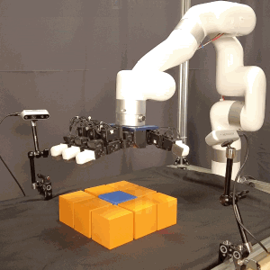             |
| :---------------------------------: | :---------------------------------: | :---------------------------------: |
| Dense arrangement with 4 obstacles  | Dense arrangement with 6 obstacles  | Dense arrangement with 8 obstacles  |
|             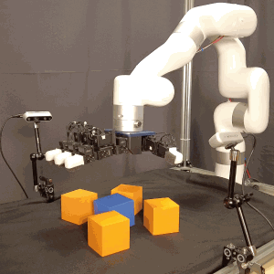             |             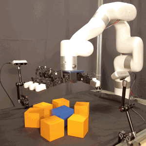             |             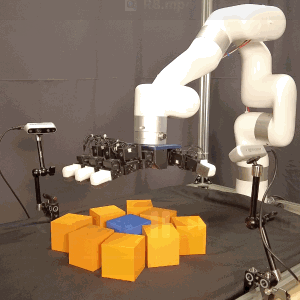             |
| Random arrangement with 4 obstacles | Random arrangement with 6 obstacles | Random arrangement with 8 obstacles |

## BibTex

```bibtex
@article{xu2025dexsingrasp,
    title={DexSinGrasp: Learning a Unified Policy for Dexterous Object Singulation and Grasping in Cluttered Environments},
    author={Xu, Lixin and Liu, Zixuan and Gui, Zhewei and Guo, Jingxiang and Jiang, Zeyu and Xu, Zhixuan and Gao, Chongkai and Shao, Lin},
    journal={arXiv preprint},
    year={2025}
}
```
